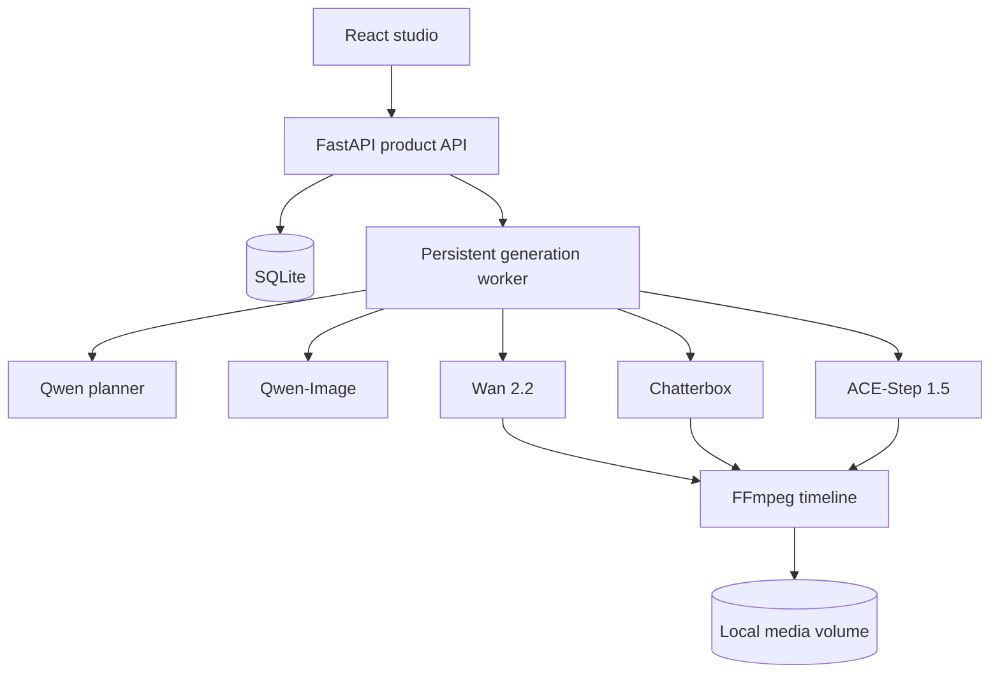

# Vigen AI 2 — Open-source multimodal ad studio

Vigen turns a campaign brief into a planned, evaluated and assembled video advertisement. Version 2 removes all AWS services and uses replaceable open-source model runners.

## What changed

- AWS Bedrock, Polly, S3 and DynamoDB removed
- Qwen planning through local Ollama
- Qwen-Image keyframe adapter
- Wan 2.2 image-to-video adapter
- Chatterbox Multilingual voice-over adapter
- ACE-Step 1.5 music adapter and automatic voice/music mix
- SQLite metadata and local media storage
- persistent job requests and restart recovery
- internal worker authentication
- exact scene-length audio padding to prevent sync drift
- real frontend API client with token refresh
- campaign fields for audience, goal, channel, aspect ratio, language, tone and CTA
- deterministic demo provider for laptop-friendly end-to-end testing

## Quick start (no GPU)

```bash
cp .env.example .env
docker compose up --build
```

Open <http://localhost:3000>. The demo provider creates a complete 24-second placeholder advertisement locally. This validates authentication, job persistence, progress polling, FFmpeg assembly, playback and download without model weights.

## Real open-source generation

Read [MODEL_STACK.md](MODEL_STACK.md), install the model runners on a suitable GPU host, and set `GENERATION_PROVIDER=commands`. Each modality is a command adapter, so models can be upgraded independently.

Wan 2.2 A14B is the quality profile and requires a high-memory GPU. Wan 2.2 TI2V-5B or a hosted GPU is the practical portfolio-demo profile. Do not try to install all model weights inside the web containers.

## Architecture



## Verification

```bash
cd app/frontend && npm ci && npm run build
python -m compileall -q app/backend/app crew-api/app model-runners
```

The model adapters are intentionally isolated under `model-runners/`; the core application never needs PyTorch. Generated media and database data live in the `vigen-data` Docker volume.

## Production notes

- Replace both secrets in `.env` before exposing the app.
- Put the application behind TLS and a reverse proxy.
- Run one worker per assigned GPU; keep `WORKER_CONCURRENCY=1` for large video models.
- Mount persistent storage or replace the repository interfaces with PostgreSQL/object storage.
- Only clone voices with explicit permission.
- Review each model card and output policy before commercial use.

MIT-licensed application code. Model weights retain their own licences.
